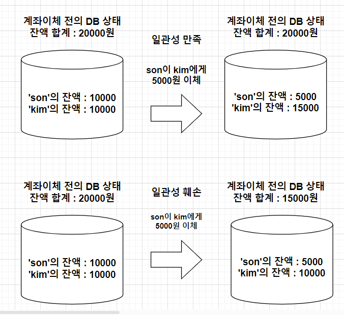

# 트랜잭션
* 데이터베이스 관리 시스템에서 발생하는 작업의 논리적 단위를 나타내는 개념
* 트랙재션은 DB의 일관성, 무결성 및 동시성 제어를 위해 *ACID* 속성을 준수해야 한다.


# ACID
## 1. 원자성(Atomicity)
* 원자성이란? 어떠한 것이 더 이상 쪼개질 수 없는 성질을 말한다. 
  * 출처 - 위키백과: https://ko.wikipedia.org/wiki/%EC%9B%90%EC%9E%90%EC%84%B1
*  트랜잭션의 원자성이란 모든 데이터베이스 작업은 쪼갤 수 없는 하나의 단위이며, 이말은 즉 하나의 작업은 쪼갤 수 없고 전체로 간주되며 
모든 작업이 성공하거나 시래하거나 중간 상태가 없는 것을 의미한다.
* 따라서, 트랙잭션의 원자성 속성은 작업 중 하나의 단계가 실패하면 이전에 수행된 모든 단계는 수행 이전의 초기 상태로 롤백되어야 한다는 원칙을 말한다.


## 2.일관성(Consistency)
* 트랜잭션의 일관성은 트랜잭션 실행 후, 데이터베이스가 일관된 상태를 유지해야 함을 의미한다.  
  * 출처 - 네이버 지식백과 : https://terms.naver.com/entry.naver?docId=3431261&cid=58430&categoryId=58430



## 3.고립성(Isolation) 
* 고립성 또는 독립성은 트랜잭션을 수행할 때 다른 트랜잭션의 연산 작업이 끼어들지 못하도록 보장하는 것을 의미


## 4. 지속성(Durability)
* 성공적으로 수행된 트랜잭션은 영원히 반영되어야 함을 의미
* 시스템 장애 및 전원손실과 같은 상황에서 데이터의 손실을 방지해야 하기 위함.

* *참고* 전형적으로 모든 트랜잭션은 로그로 남으며 시스템 장애 발생 전 상태로 되돌릴 수 있음. 
  * 트랜댁션은 로그에 모든 것이 저장된 후에만 commit 상태로 간주될 수 있음.


# 트랜잭션의 기본 흐름
1. 시작
2. 작업 수행
3. 롤백(ROLLBACK) : 하나 이상의 작업이 실패한 경우, 이전 상태로 DB를 복원
4. 커밋(COMMIT): 모든 작업이 성공적으로 완료되었을 때 DB에 변경사항을 영구적으로 저장


* *참고* transaction. 특별한일 없으면 runtimeException에서 롤백됨. Checked 에서는 롤백 안됨
* checked에서 롤백을 원하면 명시적으로 작성해야함. 
```java
@Transactional(rollbackFor = Exception.class)
```

같은 클래스 내에서 transactional 메서드를 생성하고 같은 클래스에서 호출할 경우
프록시가 생성되지 않음.

클래스 레벨에 Transactional을 명시할 경우, 모든 메서드가 적용됨.

Service 만들 때 Transactional 을 명시할 것